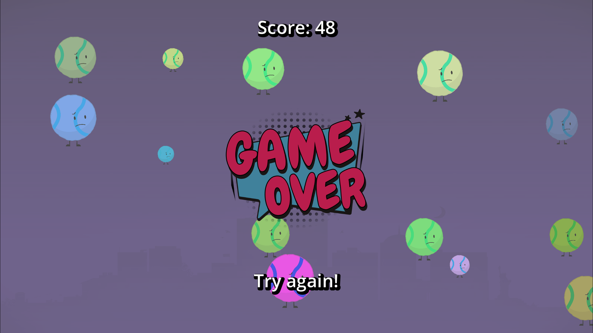

# 🎯 Balls Chaos

A small fast-paced game made in **2 hours 24 minutes** with **Godot 4.5.**  
_This was made to test [ziva.sh](https://ziva.sh/), an AI tool for Godot._

---

# 🕹️ Play

Move the mouse to dodge the balls.  
Stay alive as long as you can.  
Click to restart when you lose.

---

# ⚡ Features

- Smooth background color shift
- Random ball sizes and colors
- Increasing velocity and spawn rate over time
- Clean UI with score and game over popup
